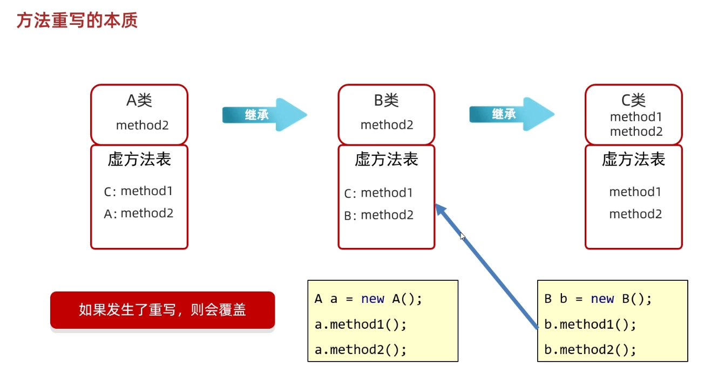

# Java 面向对象总结

## 封装

原则：对象代表什么，就封装对应的数据，并提供对应的行为。

## 继承

继承主要解决的问题为:**共性抽取**

- Java只能单继承：一个类只能继承一个直接父类

- Java不支持多继承、但是支持多层继承

- Java中所有的类都直接或者间接继承于object类

  

Java中提供一个关键字extends，用这个关键字可以让一个类和另一个类建立起继承关系

```java
public class Student extends Person{}
```

Student称为子类（派生类），Person称为父类（基类或超类）

### 使用继承的好处

- 可以把多个子类中重复的代码抽取到父类中了，提高代码的复用性。

- 子类可以在父类的基础上，增加其他的功能，使子类更强大。

### 子类能继承父类中的哪些内容？

- 子类无法继承父类中的构造方法

- 子类能继承父类中的成员变量，其中私有成员变量可以继承但不能直接使用

- 子类能继承虚方法表中的成员方法


### 继承中的成员变量访问

访问特点：**就近原则**

先在局部位置找，本类成员位置找，父类成员位置找，逐级往上

如出现重名的成员变量：

```java
System.out.println(name);//从局部位置开始往上找
System.out.println(name);//从本类成员位置开始往上找
System.out.println(name);//从父类成员位置开始往上找
```

### 继承中的成员方法访问

**访问特点：**

this调用：就近原则

super调用：直接找父类

### 继承中的构造方法访问

- 子类不能继承父类的构造方法，但是可以通过super调用
- 子类构造方法的第一行，有一个默认的super()
- 默认先访问父类中无参的构造方法，再执行自己
- 如果想要方法文父类有参构造，必须手动书写

## 方法重写

当父类的方法不能满足子类现在的需求时，需要进行方法重写

在继承体系中，子类出现了和父类中一模一样的方法声明，我们就称子类这个方法是重写的方法

#### @Override重写注解

- @override是放在重写后的方法上，校验子类重写时语法是否正确
- 加上注解后如果有红色波浪线，表示语法错误
- 建议重写方法都加@Override注解

#### 注意事项和要求

- 重写方法的名称、形参列表必须与父类中的一致
- 子类重写父类方法时，访问权限子类必须大于等于父类
- 子类重写父类方法时，返回值类型子类必须小于等于父类
- 建议: 重写的方法尽量和父类保持一致
- 只有被添加到虚方法表中的方法才能被重写

#### 方法重写的本质

覆盖虚方法表中的方法



## 多态

```java
//格式
父类 对象名=new 子类();
接口名称 对象名 = new 实现类名称();
```

#### 概念

对象的多种形态

#### 使用前提

- 有继承/实现关系
- 有父类引用指向子类对象
- 有方法的重写

#### 优势与弊端

- 优势：方法中，使用父类型作为参数，可以接收所有子类对象
- 弊端：不能使用子类的特有功能

#### 调用成员的特点

- 成员变量：编译看左边，运行也看左边
- 成员方法：编译看左边，运行看右边

（成员方法运行看右边的底层原理：虚方法表中的方法被子类重写覆盖）

#### 引用数据类型的类型转换

##### 自动类型转换

```java
Person p = new Student();
```

其实就是多态，不能调用子类的特有功能

##### 强制类型转换

```java
Student s = (Student) p;
```

- 可以转换成真正的子类类型，从而调用子类独有功能
- 转换类型与真实对象类型不一致会报错
- 转换的时候用instanceof关键字进行判断

#### instanceof关键字

```java
//格式
//对象名 instanceof 类名称
if(a instanceof Dog){
  Dog d = (Dog) a
}
```

返回值是一个boolean值，可以用来判断前面的对象能不能当做后面类型的实例。

## 包

包就是文件夹，用来管理各种不同功能的lava类

**包名书写的规则：**

- 公司域名反写 + 包的作用 ，需要全部英文小写，见名知意

## final

#### 常量

实际开发中，常量一般作为系统的配置信息，方便维护，提高可读性

常量的命名规范：

- 单个单词:全部大写
- 多个单词:全部大写，单词之间用下划线隔开

#### final修饰的特点细节

final修饰方法：最终方法，不能被重写

final修饰类：最终类，不能被继承

final修饰变量：是常量，不能被修改

- 基本数据类型：变量的值不能修改

- 引用数据类型:：地址值不能修改，内部的属性值可以修改

## 权限修饰符


## 代码块

### 局部代码块

格式：{……}       写在方法内

作用：提前结束变量的生命周期

### 构造代码块

格式：{……}      写在成员位置

创建对象时先执行构造代码块再执行构造方法

作用：抽取构造方法中的重复代码（不够灵活）

### 静态代码块

格式：static{}，写在成员位置

随着类的加载而加载，并且自动触发、只执行一次

作用：数据的初始化

## 抽象类和抽象方法

### 抽象类的作用

- 抽取共性时，无法确定方法体，就把方法定义为抽象的
- 强制让子类按照某种格式重写
- 抽象方法所在的类，必须是抽象类

### 代码格式

```java
public abstract 返回值类型 方法名(参数列表);
public abstract class 类名();
```

### 注意事项

- 抽象类不能实例化
- 抽象类中不一定有抽象方法，有抽象方法的类一定是抽象类
- 可以有构造方法
- 抽象类的子类

​           要么重写抽象类中的所有抽象方法

​           要么是抽象类

## 接口

### 接口的定义和使用

- 接口用关键字interface来定义

```java
public interface 接口名{}
```

- 接口不能实例化

- 接口和类之间是实现关系，通过implements关键字表示

```java
public class 类名 implements 接口名{}
```

- 接口的子类(实现类)

  要么重写接口中的所有抽象方法

  要么是抽象类

### 注意事项和细节

- 接口和类的实现关系，可以单实现，也可以多实现。

```java
public class 类名 implements 接口名1,接口名2{}
```

- 实现类还可以在继承一个类的同时实现多个接口

```java
public class 类名 extends 父类 implements 接口名1,接口名2{}
```

### 接口中成员的特点

- 成员变量

  只能是常量

  默认修饰符：public  static  final

- 构造方法

  没有

- 成员方法

  只能是抽象方法

  默认修饰符：public  abstract

  

JDK特性：

- JDK7以前:接口中只能定义抽象方法
- JDK8的新特性:接口中可以定义有方法体的方法
- JDK9的新特性: 接口中可以定义私有方法

### 接口与类之间的关系

- 类和类的关系

  继承关系，只能单继承，不能多继承，但是可以多层继承

- 类和接口的关系

  实现关系，可以单实现，也可以多实现，还可以在继承一个类的同时实现多个接口

- 接口和接口的关系

  继承关系，可以单继承，也可以多继承

## 内部类

在一个类的里面，再定义一个类

**内部类的访问特点：**

- 内部类可以直接访问外部类的成员，包括私有
- 外部类要访问内部类的成员，必须先创建内部类的对象

### 成员内部类

写在成员位置，属于外部类的成员

#### 获取成员内部类对象的方法

方法一：当成员内部类被private修饰时

​               在外部类编写方法，对外提供内部类对象

方法二：当成员内部类被非私有修饰时，直接创建对象

```java
//外部类名.内部类名 对象名 = new 外部类名(). new 内部类名();
Outer.Inner oi = new Outer().new Inner();
```

#### 内部类获取外部类成员

- 不重名直接访问
- 重名用类名.this访问

```java
System.out.println(Outer.this.变量名);
```

### 静态内部类

静态内部类是一种特殊的成员内部类

#### 直接创建静态内部类对象的方式

```java
//外部类名.内部类名 对象名 = new 外部类名.内部类名();
Outer.Inner oi = new Outer.Inner();
```

#### 调用静态内部类中的方法

- 非静态方法： 先创建对象，用对象调用
- 静态方法：外部类名.内部类名.方法名();

### 局部内部类

- 将内部类定义在方法里面就叫局部内部类，类似于方法里面的局部变量
- 外界是无法直接使用局部内部类，需要在方法内部创建对象并使用
- 该类可以直接访问外部类的成员，也可以访问方法内的成员 

### 匿名内部类

隐藏了名字的内部类，可以写在成员位置，也可以写在局部位置

#### 格式

```java
new 类名或者接口名(){
    重写方法;
}
```

包含了继承或实现，方法重写，创建对象

整体就是一个类的子类对象或者接口的实现类对象

#### 使用场景

当方法的参数是接口或者类时，

以接口为例，可以传递这个接口的实现类对象，

如果实现类只要使用一次，就可以用匿名内部类简化代码。