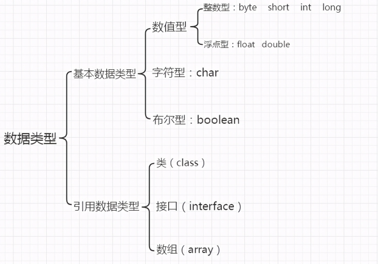
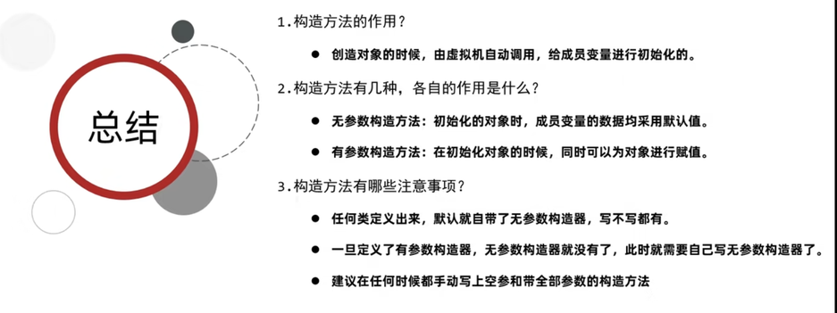
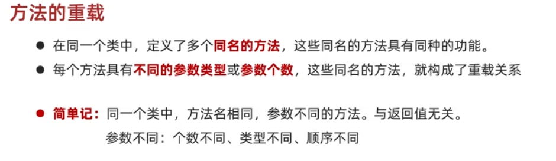

# Java笔记 Week 1

## 前言

**·**笔者之前没有做笔记的习惯，对知识点基本只是进行简单的人脑记忆，晦涩难懂的知识也只是随便找个文档或者笔记本记录，没有专门进行总结归纳过。在这编写Java笔记算是一个新的开始，希望能够有所提高和感悟。

·本周比较忙，学习的知识不多，且知识点比较简单，所以本周笔记主要对Java的基础语法与C语言进行类比与归纳，并简单描述面向对象的基础知识。

## Week 1 总结

1. 下载安装了jdk和IDEA并进行了环境变量配置和熟悉基本的操作；
2. 学习了Git的基础简单操作，能够通过Git将本地仓库上传到远程仓库;
3. 学习了JAVA的基础语法和面向对象的基础知识；
4. 练习编写了几个简单的题目


## 一、Java基础语法

### 1）关键字与标识符

#### 1.关键字

Java中的关键字所有字母都是小写，这点跟C语言是一样的。

#### 2.标识符

由26个英文字母大小写，0-9, _或$组成。

数字不可以开头。

不可以使用关键字和保留字，但能包含关键字和保留字。

与C语言相比，Java中的标识符可由美元符号$组成，而C语言不行。

### 2）数据类型



与C语言的不同：

1. Java的基本数据类型多了byte和boolean
2. Java 定义 long 型变量，要以 l 或 L 结尾
3. Java 定义 float 型变量，要以 f 或 F 结尾
4. boolean的取值为true 或 false

### 3）不同进制的表示方法

二进制：以0b或0B开头

八进制：以0开头

十六进制：以0x或0X开头

### 4）运算符

#### 1.算术运算符

  加减乘除模 

```
\+ - * / %
```

  与C语言总体差别不大

  但特别地，对于%运算，Java不但可以对整数进行取模，还可以对double进行取模

#### 2.自增自减运算符

前置/后置 加加/减减 

```
++   --
```

与C语言差别不大

#### 3.赋值运算符

```
=  +=   -=   *=   %=
```

与C语言差别不大

#### 4.关系运算符

```
==  !=  >  <  >=  <= 
```

特别地， Java关系运算符的结果是 boolean 类型，要么是true，要么是false

#### 5.逻辑运算符

```
&   &&   |   ||   !   ^
```

与C语言差别不大，只是&&叫短路与，||叫短路或。

#### 6.三元运算符

```
 (条件表达式) ? 表达式1 : 表达式2
```

也就是C语言中的三目运算符

### 5）基础语句

这部分与C语言相同，没什么特别说明的

#### 1.判断语句

if-else条件判断语句

#### 2.分支语句

switch-case语句

#### 3.循环语句

for，while，do...while

关键字continue，break


### 6）数组

在数组部分开始与C语言开始有了一些差别。与C语言不同的是，Java需要用new创建数组。


数组的静态初始化

```
//完整格式
//数据类型 [] 数组名 = new 数据类型{元素1，元素2，元素3};
int []arr=new int[]{1,2,3};
//简化格式
//数据类型 [] 数组名 = {元素1，元素2，元素3};
int []arr={1,2,3};
```

数组的动态初始化

```
//格式:
//数据类型[] 数组名 = new 数据类型[数组的长度];
int []arr = new int[5];
```

数组默认初始化值的规律

1. 整数类型：默认初始化值0
2. 小数类型：默认初始化值0.0
3. 字符类型：默认初始化值"/u0000’ 空格
4. 布尔类型：默认初始化值 false
5. 引用数据类型：默认初始化值 null

### 7）方法

类型于C语言中的函数。特别地，Java中有方法的重载。





## 二、面向对象

### 1.面向对象的三大基本特征

封装、继承、多态

### 2.类和对象

如何定义类

```
public class 类名{
  1、成员变量
  2、成员方法
  3、构造器
  4、代码块
  5、内部类
}
```

如何得到类的对象

```
//类名 对象名 = new类名();
Phone p = new Phone();
```

如何使用对象

```
//访问属性: 对象名.成员变量
//访问行为: 对象名.方法名(...)
```

 

### 3.封装

原则：对象代表什么，就封装对应的数据，并提供对应的行为。

### 4.private关键字

private是一个权限修饰符，可以修饰成员变量，且被修饰的成员变量只能在本类中访问，保障了数据的安全性。

针对private修饰的成员变量，如果需要被其他类使用，提供相应的操作：

提供“setXxx(参数)”方法，用于给成员变量赋值，方法用public修饰

提供 “getXxx()”方法，用于获取成员变量的值，方法用public修饰

### 5.this关键字

this的作用: 区分局部变量和成员变量

this的本质: 所在方法调用者的地址值

### 6.Javabean

标准的Javabean类：

1. 类名需要见名知意

2. 成员变量使用private修饰

3. 提供至少两个构造方法

    ①无参构造方法

    ②带全部参数的构造方法

4. 成员方法

​        ①提供每一个成员变量对应的setXxx()/getXxx()

​        ②如果还有其他行为，也需要写上