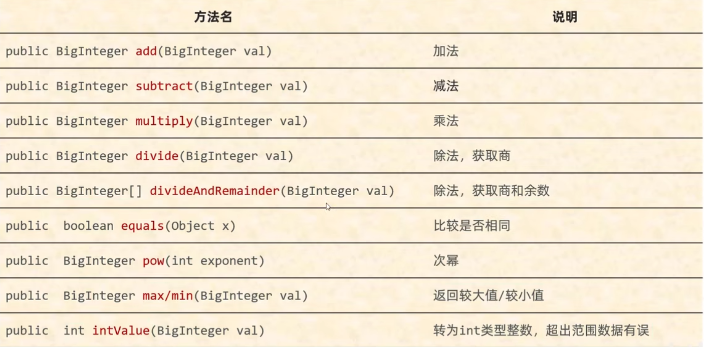
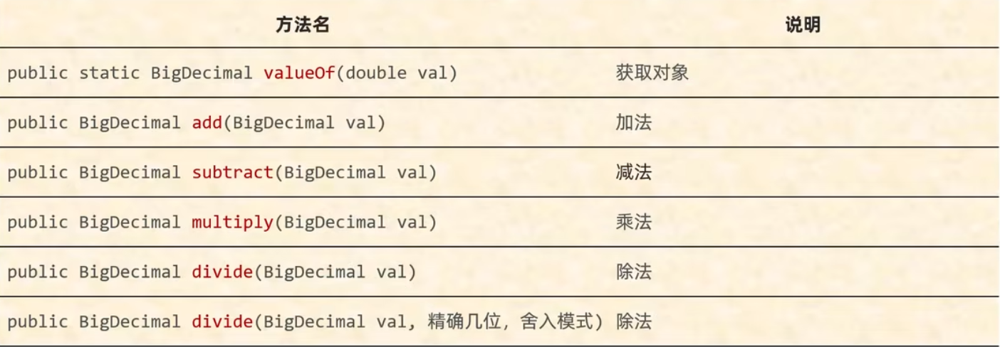
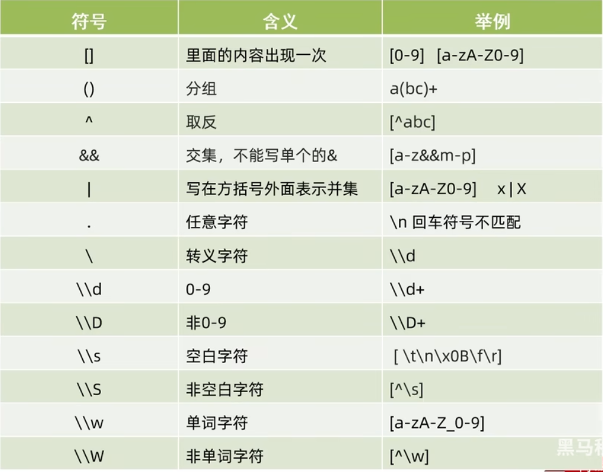
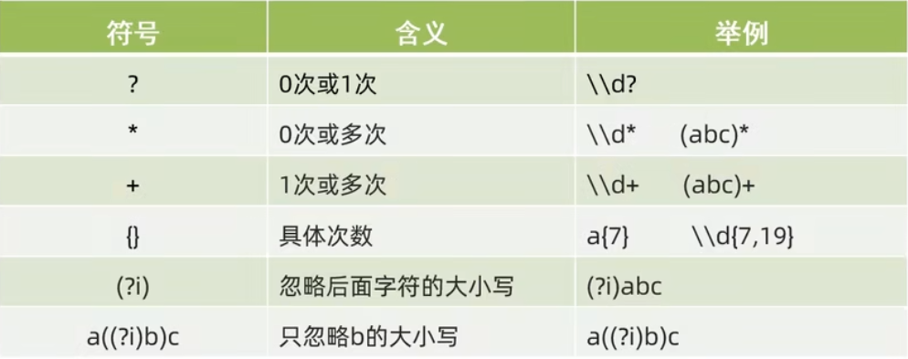

# 常用API

## Math

| 方法名称                                    | 说明                                    |
| ------------------------------------------- | --------------------------------------- |
| public static int abs(int a)                | 获取参数绝对值                          |
| public static double ceil(double a)         | 向上取整                                |
| public static double floor(double a)        | 向下取整                                |
| public static int round(float a)            | 四舍五入                                |
| public static int max(int a,int b)          | 获取两个int值中的较大值                 |
| public static int min(int a,int b)          | 获取两个int值中的较小值                 |
| public static double sqrt(double a)         | 返回正确舍入的 double 值的正平方根。    |
| public static double cbrt(double a)         | 返回 double 值的立方根                  |
| public static double pow(double a,double b) | 返回a的b次幂的值                        |
| public static double random()               | 返回值为double的随机值，范围[0.0 , 1.0] |


## System

| 方法名称                                                     | 说明                                                        |
| ------------------------------------------------------------ | :---------------------------------------------------------- |
| public static void exit(int status)                          | 终止当前运行的 java 虚拟机<br />（0:正常停止;非0:异常停止） |
| public static long currentTimeMillis()                       | 返回当前系统的时间毫秒值形式                                |
| public static void arraycopy(原数组,起始索引,目的数组,起始索引,拷贝个数) | 数组拷贝                                                    |

返回系统的时间毫秒值相减，可以得出代码从某一处运行到另一处消耗的时间毫秒值

数组拷贝代码示例：

```java
int[] arr1 = {1,2,3,4,5,6,7,8,9,10};
int[] arr2 = new int[10];
System.arraycopy(arr1,0,arr2,4,3);
```


## Runtime

| 方法名称                            | 说明                                     |
| ----------------------------------- | ---------------------------------------- |
| public static Runtime getRuntime()  | 当前系统的运行环境对象                   |
| public int availableProcessors()    | 获得CPU的线程数                          |
| public long maxMemory()             | JVM能从系统中获取总内存大小 (单位byte)   |
| public long totalMemory()           | JVM已经从系统中获取总内存大小 (单位byte) |
| public long freeMemory()            | JVM剩余内存大小 (单位byte)               |
| public Process exec(string command) | 运行cmd命令                              |


## Object

| 方法名称                          | 说明                     |
| --------------------------------- | ------------------------ |
| public String tostring()          | 返回对象的字符串表示形式 |
| public boolean equals(object obj) | 比较两个对象是否相等     |
| protected Object clone(int a)     | 对象克隆                 |

- Object是Java中的顶级父类
- 所有的类都直接或间接的继承于Object类
- tostring()：一般会重写，打印对象时打印属性
- equals()：比较对象时会重写，比较对象属性值是否相同
- clone()：默认浅克隆。


## Objects

Objects是一个对象工具类，提供了一些操作对象的方法

| 方法名称                                         | 说明                                     |
| ------------------------------------------------ | ---------------------------------------- |
| public static boolean equals(Object a, Object b) | 先做非空判断，比较两个对象               |
| public static boolean isNull(Object obj)         | 判断对象是否为nul1，为nul1返回true ,反之 |
| public static boolean nonNull(Object obj)        | 判断对象是否为nu11，跟isNull的结果相反   |

```java
//创建学生类的对象
Student s1 = null;
Student s2 = new Student("zhangsan", 23);
//比较两个对象的属性值是否相同
if(s1 != null){
    boolean result = s1.equals(s2);
    System.out.println(result);
}else{
    System.out.println("调用者为空");
}
boolean result = Objects.equals(s1, s2);
System.out.printIn(result);
```

细节:

- 方法的底层会判断s1是否为nu11，如果为nu11，直接返回false

- 如果s1不为nu11，那么就利用s1再次调用equals方法

- 此时s1是student类型，所以最终还是会调用student中的equals方法。

  如果没有重写，比较地址值，如果重写了，就比较属性值。


## BigInterger

### 常用方法

| 方法名称                                   | 说明                                     |
| ------------------------------------------ | ---------------------------------------- |
| public BigInteger(int num,Random rnd)      | 获取随机大整数，范围：[0 ~ 2的num次方-1] |
| public BigInteger(string val)              | 获取指定的大整数                         |
| public BigInteger(string val,int radix)    | 获取指定进制的大整数                     |
| public static BigInteger valueOf(long val) | 静态方法获取BigInteger的对象，内部有优化 |



### 创建对象

```
//静态方法
BigInteger b1 = BigInteger.valueOf(10000);
//构造方法
BigInteger b2 = new BigInteger("10000");
```

- 如果BigInteger表示的数字没有超出long的范围，可以用静态方法获取
- 如果BigInteger表示的超出long的范围，可以用构造方法获取
- 对象一旦创建，BigInteger内部记录的值不能发生改变
- 只要进行计算都会产生一个新的BigInteger对象


## BigDecimal

表示较大的小数和解决小数运算精度失真问题

### 常用方法



```
divide(四舍五入: RoundingMode.HALF_UP)
```

### 创建对象

```java
//构造方法
BigDecimal bd1 = new BigDecimal("较大的小数");
//静态方法
BigDecimal bd2 = BigDecimal.valueof(0.1);
```

- 如果要表示的数字不大，没有超出double的取值范围，建议使用静态方法
- 如果要表示的数字比较大，超出了double的取值范围，建议使用构造方法
- 如果我们传递的是0~10之间的整数，包含0，包含10，那么方法会返回已经创建好的对象，不会重新new


## 正则表达式





**代码示例：**

```java
//校验手机号格式
string regex ="1[3-9]\\d{9}";
System.out.println("13112345678".matches(regex));
```


## 日期