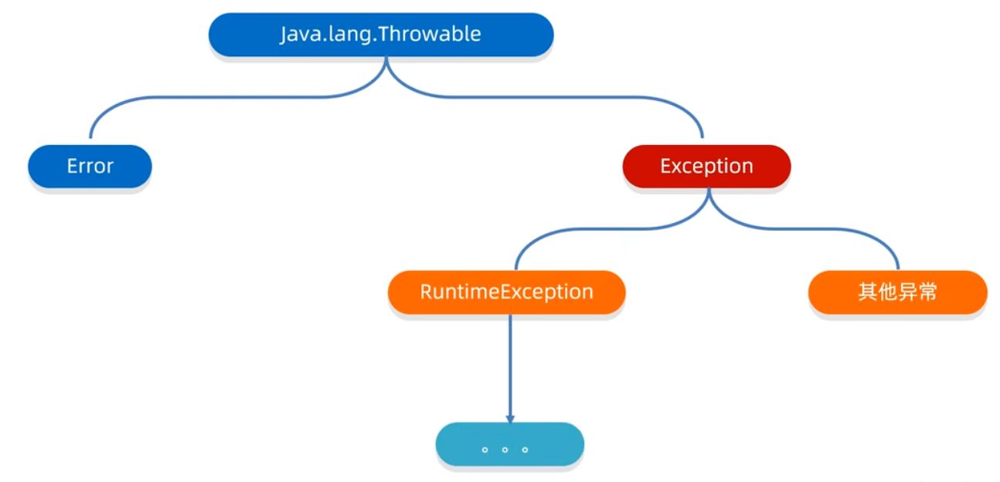

# 异常

## 异常体系结构



- Error：代表的系统级别错误(属于严重问题)

- Exception：叫做异常，代表程序可能出现的问题。通常会用Exception以及他的子类来封装程序出现的问题

- 运行时异常：RuntimeException本身和所有子类，都是运行时异常。

  ​                       编译阶段不报错，是程序运行时出现的。一般是由于参数传递错误带来的问题

- 编译时异常：除了RuntimeException和他的子类，其他都是编译时异常。

  ​                       编译阶段需要进行处理，作用在于提醒程序员。

## 异常的处理方式

### JVM默认的处理方式

- 把异常的名称，异常原因及异常出现的位置等信息输出在了控制台
- 程序停止执行，下面的代码不再执行


### 捕获异常

**格式：**

```java
try{
    可能出现异常的代码;
}catch(异常类名 变量名){
    异常的处理代码;
}
//代码示例：
int[] arr = {1,2,3,4,5,6};
try{
    System.out.println(arr[10]);
}catch(ArrayIndexOutOfBoundsException e){
    e.printStackTrace();
}
```

**目的：**当代码出现异常时，可以让程序继续往下执行

> ①如果try中没有遇到问题，怎么执行?
>
> ——会把try里面所有的代码全部执行完毕，不会执行catch里面的代码
>
> ②如果try中可能会遇到多个问题，怎么执行?
>
> ——写多个catch与之对应，父类异常需要写在下面
>
> ③如果try中遇到的问题没有被捕获，怎么执行?
>
> ——相当于try...catch白写了，当前异常会交给虚拟机处理
>
> ④如果try中遇到了问题，那么try下面的其他代码还会执行吗?
>
> ——不会。try中遇到问题，直接跳转到对应的catch。如果没有对应的catch与之匹配，则交给虚拟机处理


### 抛出异常

#### throw

写在方法内，结束方法。手动抛出异常对象，交给调用者，方法中下面的代码不再执行

```java
public void 方法(){
    throw new NullPointerException();
}
```


#### throws

写在方法定义处，表示声明一个异常。告诉调用者，使用本方法可能会有哪些异常

```java
public void 方法()throws 异常类名1,异常类名2...{
    ...
}
```

- 编译时异常：必须要写
- 运行时异常：可以不写


## Throwable成员方法

| 方法名称                      | 说明                              |
| ----------------------------- | --------------------------------- |
| public String getMessage()    | 返回此 throwable 的详细消息字符串 |
| public String toString()      | 返回此可抛出的简短描述            |
| public void printStackTrace() | 把异常的错误信息输出在控制台      |


## 自定义异常

**意义：**让控制台的报错信息更加的见名知意

**步骤：**

1. 定义异常类，名字一般以Exception结尾，见名知意
2. 写继承关系，一般继承RuntimeException
3. 创建空参构造和带参构造
4. 在其他类的方法需要异常处理时，对自定义异常类进行抛出或捕获处理

