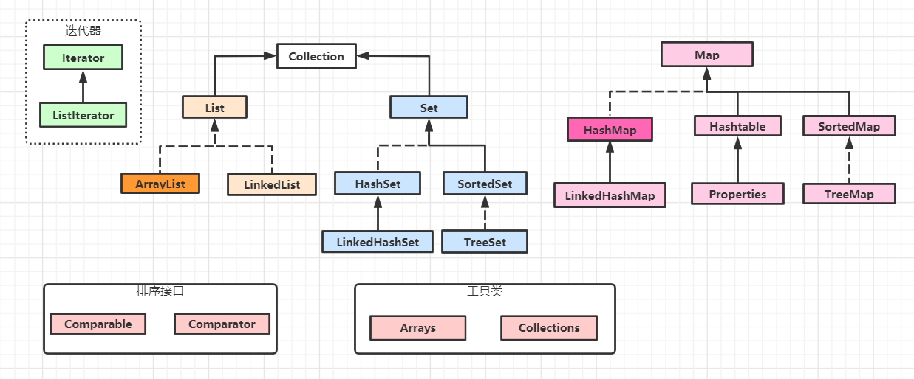
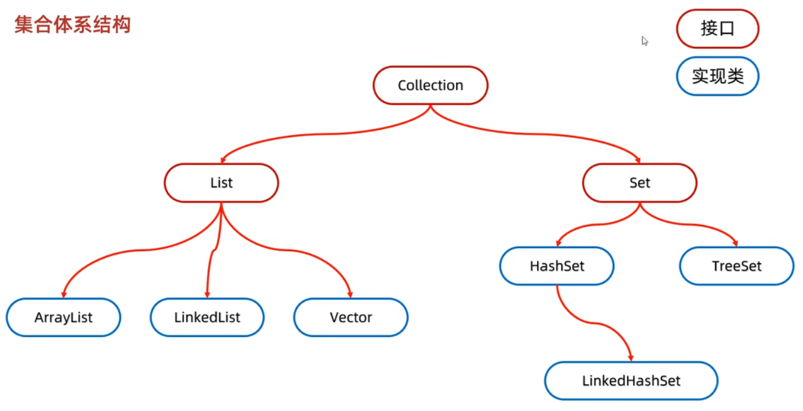
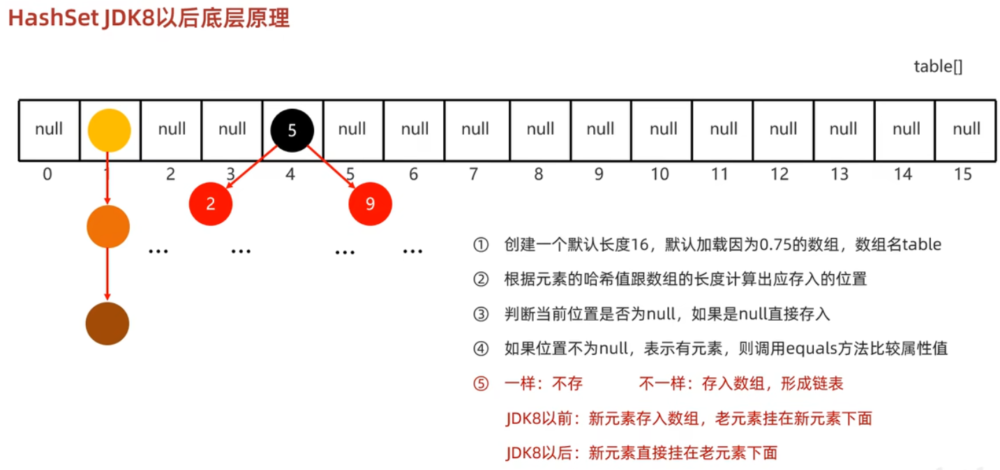
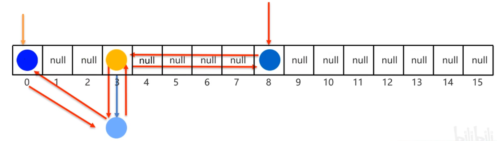

# 集合

## 集合体系结构



Collection单列集合

Map双列集合

## Collection

### 体系结构



List系列集合：添加的元素是有序、可重复、有索引

Set系列集合：添加的元素是无序、不重复、无索引

### 常用方法

Collection是单列集合的顶层接口，所有方法被List和Set系列集合共享继承使用。

| 方法名称                            | 说明                             |
| ----------------------------------- | -------------------------------- |
| public boolean add(E e)             | 把给定的对象添加到当前集合中     |
| public void clear()                 | 清空集合中所有的对象             |
| public boolean remove(E e)          | 把给定的对象在当前集合中删除     |
| public boolean contains(Object obj) | 判断当前集合中是否包含给定的对象 |
| public boolean isEmpty()            | 判断当前集合是否为空             |
| public int size()                   | 返回集合中元素的个数/集合的长度  |

**细节注意：**

- contains方法在底层依赖equals方法判断对象是否一致
- 如果存的是自定义对象，没有重写equals方法，那么默认使用object类中的equals方法进行判断，object类中equals方法，依赖地址值进行判断
- 如需判断对象的属性值是否一致，需要在自定义的Javabean类中，重写equals方法


### 遍历方式

#### 迭代器遍历

迭代器在Java中的类是**Iterator**，迭代器是集合专用的遍历方式

##### 常用方法

| 方法名称               | 说明                                                      |
| ---------------------- | --------------------------------------------------------- |
| Iterator<E> iterator() | 返回迭代器对象，默认指向当前集合的0索引                   |
| boolean hasNext()      | 判断当前位置是否有元素，有元素返回true ,没有元素返回false |
| E next()               | 获取当前位置的元素，并将迭代器对象移向下一个位置          |
| default void remove()  | 从底层集合中删除此迭代器返回的最后一个元素（可选操作）    |

##### 代码示例

```java
//创建集合并添加元素
Collection<String> coll = new ArrayList<>();
coll.add("aaa");
coll.add("bbb");
coll.add("ccc");
//获取迭代器对象
Iterator<String> it = coll.iterator();
//利用循环获取集合中每一个元素
while(it.hasNext()){
    String str = it.next();
    System.out.println(str);
    if("bbb".equals(str)){
        coll.remove("bbb");
    }
}
```

##### 注意细节

- 迭代器在遍历集合的时候是不依赖索引的
- 如果当前位置没有元素，还要强行获取，会报NoSuchElementException
- 迭代器遍历完毕，指针不会复位
- 循环中只能用一次next方法
- 迭代器遍历时，不能用集合的方法进行增加或者删除


#### 增强for遍历

- 增强for的底层是一个Iterator迭代器，为了简化迭代器的代码书写的
- 所有单列集合和数组才能用增强for进行遍历

##### 格式与示例

Idea快速生成方式：集合/数组的名字.for  回车

```java
for（元素的数据类型 变量名：数组或者集合）{
} 

for(String s : list){
    System.out.println(s);
}
```

##### 注意细节

- 变量名是第三方变量，在循环的过程中依次表示集合中的每一个数据
- 修改增强for中的变量，不会改变集合中原本的数据


#### Lambda表达式遍历

##### Lambda表达式

**标准格式**

```java
() ->{

}
// ()  对应方法的形参
// ->  固定格式
// {}  对应方法的方法体
```

- Lambda表达式可以用来简化匿名内部类的书写
- Lambda表达式只能简化函数式接口的匿名内部类的写法
- 函数式接口:
  有且仅有一个抽象方法的接口叫做函数式接口，接口上方可以加@FunctionalInterface注解


**省略写法：**

**省略核心: 可推导，可省略**

- 参数类型可以省略不写
- 如果只有一个参数，参数类型可以省略，同时()也可以省略
- 如果Lambda表达式的方法体只有一行，大括号，分号，return可以省略不写，需要同时省略

```java
//匿名内部类
Arrays.sort(arr, new Comparator<Integer>(){
    @Override
     public int compare(Integer o1, Integer o2){
         return o1 - o2;
     }
});  
//Lambda表达式
Arrays.sort(arr, (Integer o1, Integer o2) -> {
             return o1 - o2;
        }
};
//省略写法
Arrays.sort(arr, (o1, o2) -> o1 - o2};
```


##### 代码示例

```java
//创建集合并添加元素
Collection<String> coll = new ArrayList<>();
coll.add("aaa");
coll.add("bbb");
coll.add("ccc");
//匿名内部类方式
//forEach底层原理:遍历集合，依次得到每一个元素把得到的每一个元素,传递给下面的accept方法
//s依次表示集合中的每一个数据
coll.forEach(new Consumer<String>(){
    @Override
     public void accept(String s){
         System.out.println(s);
     }
});
//Lambda表达式
coll.forEach(s -> System.out.println(s));
```


#### 使用总结

- 迭代器：在遍历的过程中需要删除元素，使用迭代器
- 增强for、Lambda：仅需遍历，使用增强for或Lambda表达式


### List

有序、可重复、有索引

#### 特有方法

| 方法                          | 说明                                                         |
| ----------------------------- | ------------------------------------------------------------ |
| void add(int index,E element) | 在此集合中的指定位置插入指定的元素（添加后后面元素索引向后移一位） |
| E remove(int index)           | 删除指定索引出的元素，返回被删除的元素                       |
| E set(int index,E element)    | 修改指定索引出的元素，返回被修改的元素                       |
| E get(int index)              | 返回指定索引处的元素                                         |

**remove细节：**

remove方法调用时，List特有的方法与Collection的方法名一致，出现了方法重载现象

此时，会优先调用实参与形参类型一致的方法

```java
List<Interger> list = new ArrayList<>();
list.add(1);
list.add(2);
//删除元素
//1为int类型，优先调用特有方法，删除1索引的元素
list.remove(1); 
//如需删除1元素，需要手动装箱
Interger i = Interger.valueOf(1);
list.remove(i);
```

#### 遍历方式

**迭代器遍历**

**增强for遍历**

**Lambda表达式遍历**


**普通for遍历**

```java
//由于List集合是有序的，可以用size和get方法并通过索引来循环遍历
for(int i = 0; i < list.size(); i++){
    String s = list.get(i);
    System.out.println(s);
}
```

**列表迭代器遍历**

ListIterator 列表迭代器在 Iterator 迭代器的基础上增加了add添加元素,set修改元素等6 个方法

| 方法名称      | 说明                                                         |
| ------------- | ------------------------------------------------------------ |
| void add(E e) | 将指定的元素插入列表（可选操作）                             |
| void set(E e) | 用指定元素替换 next 或 previous 返回的最后一个元素（可选操作） |

```java
//创建集合并添加元素
List<String> list = new ArrayList<>();
list.add("aaa");
list.add("bbb");
list.add("ccc");
//获取迭代器对象
ListIterator<String> it = list.ListIterator();
//利用循环获取集合中每一个元素
while(it.hasNext()){
    String str = it.next();
    if("bbb".equals(str)){
        it.add("qqq");
    }
}
System.out.println(list);
```


#### ArrayList

**底层原理**

1. 利用空参创建的集合，在底层创建一个默认长度为0的数组
2. 添加第一个元素时，底层会创建一个新的长度为10的数组
3. 存满时，会扩容1.5倍
4. 如果一次添加多个元素，1.5倍还放不下，则新创建数组的长度以实际为准

#### LinkedList

底层数据结构是双链表，查询慢，首尾操作的速度是极快的，所以多了很多首尾操作的特有API。

| 特有方法                  | 说明                             |
| ------------------------- | -------------------------------- |
| public void addFirst(E e) | 在该列表开头插入指定的元素       |
| public void addLast(E e)  | 将指定的元素追加到此列表的末尾   |
| public E getFirst()       | 返回此列表中的第一个元素         |
| public E getLast()        | 返回此列表中的最后一个元素       |
| public E removeFirst()    | 从此列表中删除并返回第一个元素   |
| public E removeLast()     | 从此列表中删除并返回最后一个元素 |


### Set

无序、不重复、无索引

Set接口是 Collection 的子接口，因此 Set 的方法上基本上与 Collection 的API一致

#### 遍历方式

迭代器遍历、增强for遍历、Lambda表达式遍历


#### HashSet

无序、不重复、无索引

##### 哈希值

- 根据hashCode方法算出来的int类型的整数
- 该方法定义在Object类中，所有对象都可以调用，默认使用地址值进行计算
- 一般情况下，会重写hashCode方法，利用对象内部的属性值计算哈希值


##### 对象的哈希值特点

- 如果没有重写hashCode方法，不同对象计算出的哈希值是不同的
- 如果已经重写hashcode方法，不同的对象只要属性值相同，计算出的哈希值就是一样的
- 在小部分情况下，不同的属性值或者不同的地址值计算出来的哈希值也有可能一样。(哈希碰撞）


##### 底层原理

- HashSet集合底层采取哈希表存储数据
- 哈希表是一种对于增删改查数据性能都较好的结构

**哈希表组成：**

- JDK8之前：数组+链表
- ]DK8开始：数组+链表+红黑树



**细节：**

- 加载因子：当数组长度达到 **当前数组长度*0.75（加载因子）** 时，会将数组扩容为原来的2倍
- 应存入位置：`int index = （数组长度 - 1）& 哈希值;`
- JDK8以后，当链表长度超过8，而且数组长度大于等于64时，自动转换为红黑树
- 如果集合中存储的是自定义对象，必须要重写hashCode和equals方法


#### LinkedHashSet

LinkedHashSet是HashSet的子类

**有序**、不重复、无索引

- 这里的有序指的是保证存储和取出的元素顺序一致

**底层原理：**底层数据结构是哈希表，只是每个元素额外多了一个双链表的机制记录存储的顺序




#### TreeSet

- **可排序**、不重复、无索引
- 底层基于**红黑树**实现排序，增删改查性能较好

**自定义排序规则方式**

方式一：Javabean类实现Comparable接口，指定比较规则

```java
//实现Comparable接口
public class Student implements Comparable<Student>{
    @Override
    //this:表示当前要添加的元素
    //o:表示已经在红黑树存在的元素
    public int compareTo(Student o){
        return this.getAge() - o.getAge();
    }
}
```

方式二：创建集合时，自定义Comparator比较器对象，指定比较规则

```java
TreeSet<String> ts = new TreeSet<>(new Comparator<String>(){
    @Override
     public int compare(String o1, String o2){
         //按照长度排序
         int i = o1.length() - o2.length()
         //如果一样长则按照首字母排序
         i = i== 0 ? o1.compareTo(o2) : i;
         return i;
     }
});
//也可以写成Lambda表达式
TreeSet<String> ts = new TreeSet<>((o1, o2)->{
         int i = o1.length() - o2.length()
         i = i== 0 ? o1.compareTo(o2) : i;
         return i;
});
```

**方法返回值特点**

- 负数：表示当前要添加的元素是小的，存左边
- 正数：表示当前要添加的元素是大的，存右边
- 0：表示当前要添加的元素已经存在，舍弃


## 泛型

]DK5中引入的特性，可以在编译阶段约束操作的数据类型，并进行检查。

**格式：**<数据类型>

**好处：**

- 统一数据类型
- 把运行时期的问题提前到编译期间，避免了强制类型转换可能出现的异常，因为在编译阶段类型就能确定下来

**细节：**

-  Java中的泛型是伪泛型
- 泛型中只能支持引用数据类型，不能写基本数据类型（需要写成对应的包装类）
- 指定泛型的具体类型后，传递数据时，可以传入该类类型或者其子类类型
- 如果不写泛型，类型默认是object

### 泛型类

**使用场景：**当一个类中，某个变量的数据类型不确定时，就可以定义带有泛型的类

```java
//格式
修饰符 class 类名<类型>{

}
//举例
public class ArrayList <E>{

}
//创建该类对象时，E就确定类型
//此处E可以理解为变量，但不是用来记录数据的，而是记录数据的类型，可以写成: T、E、K、V等
```


### 泛型方法

```java
//格式
修饰符<类型> 返回值类型 方法名(类型 变量名){

}
//举例
public <E> void show (E e){

}
```


### 泛型接口

```java
//格式
修饰符 interface 接口名<类型>{

}
//举例
public interface List<E>{
    
}
```

**使用方式：**

```java
//方式1.实现类给出具体类型
public class MyArrayList1 implements List<String> {

}
//方式2.实现类延续泛型，创建对象时再确定
//实现类
public class MyArrayList2<E> implements List<E>{
    
}
//创建对象
MyArrayList2<String> list = new MyArrayList2<>();
```

### 泛型的继承和通配符

泛型不具备继承性，但是数据具备继承性

```java
//泛型不具备继承性
//method()参数只能传入Animal，不能传入Animal的子类
public static void method(ArrayList<Animal> list){
    
}
//数据具备继承性
ArrayList <Ye> list1 = new ArrayList<>();
list1.add(new Ye());
list1.add(new Fu());
list1.add(new Zi());
```

？表示不确定的类型，可以进行类型的限定

```java
? extends E //表示可以传递E或者E所有的子类类型
? super E   //表示可以传递E或者E所有的父类类型

//举例说明
//只能传递Fu或者Fu的所有子类
public static void method(ArrayList<? extends Fu> list){
    
}
//只能传递Zi或者Zi的所有父类
public static void method(ArrayList<? super Zi> list){
    
}
```

## Map

### 双列集合的特点

- 双列集合一次需要存一对数据，分别为键和值
- 键不能重复，值可以重复
- 键和值是一一对应的，每一个键只能找到自己对应的值
- 键+值这个整体我们称之为“键值对”或者“键值对对象”在Java中叫做“Entry对象”

### 常用方法

| 方法名称                            | 说明                                 |
| ----------------------------------- | ------------------------------------ |
| V put(K key,V value)                | 添加元素                             |
| V remove(Object key)                | 根据键删除键值对元素，返回值         |
| void clear()                        | 移除所有的键值对元素                 |
| boolean containsKey(object key)     | 判断集合是否包含指定的键             |
| boolean containsValue(object value) | 判断集合是否包含指定的值             |
| boolean isEmpty()                   | 判断集合是否为空                     |
| int size()                          | 集合的长度，也就是集合中键值对的个数 |

**put方法的细节:**

- 添加/覆盖
- 添加数据时，如果键不存在，会直接把键值对对象添加到map集合中,方法返回null
- 添加数据时，如果键是存在的，会把原有的键值对对象覆盖，并把被覆盖的值进行返回

### 遍历方式

#### 键找值

```java
//创建Map集合对象
Map<String,String> map = new HashMap<>();
//添加元素
map.put("你","好");
map.put("我","好");
map.put("他","好");
//通过键找值
//获取所有键，存到单列集合中
Set<String> keys = map.keySet();
//遍历单列集合，得到每一个键，并获取对应的值
//增强for遍历
for (String key : keys) {
    String value = map.get(key);
    System.out.println(key+"="+value);
}
//迭代器遍历
Iterator<String> it = keys.iterator();
while(it.hasNext()){
    String key = it.next();
    String value = map.get(key);
    System.out.println(key+"="+value);
}
//Lambda表达式遍历
//匿名内部类
keys.forEach(new Consumer<String>() {
    @Override
    public void accept(String key) {
        String value = map.get(key);
        System.out.println(key+"="+value);
    }
});
//Lambda表达式
keys.forEach( key->{
    String value = map.get(key);
    System.out.println(key+"="+value);
  }
);
```

#### 键值对

```java
//通过键值对对象进行遍历
//获取所有键值对对象，返回一个Set集合
Set<Map.Entry<String, String>> entries = map.entrySet();
//遍历entries单列集合，调用get方法获取键和值
//这里可以选择迭代器遍历、增强for遍历、Lambda表达式遍历
for (Map.Entry<String, String> entry : entries) {
    String key = entry.getKey();
    String value = entry.getValue();
    System.out.println(key+"="+value);
}
```

#### Lambda表达式

```java
//匿名内部类
//forEach底层原理:利用键值对对象进行遍历，依次得到每一个键和值，再调用accept方法
map.forEach(new BiConsumer<String, String>() {
    @Override
    public void accept(String key, String value) {
        System.out.println(key+"="+value);
    }
});
//Lambda表达式
map.forEach((key,value) -> System.out.println(key+"="+value) );
```

### HashMap

- HashMap是Map里面的一个实现类
- 特点是由键决定的：无序、不重复、无索引
- HashMap跟HashSet底层原理是一模一样的，都是哈希表结构
- 存入位置利用键计算哈希值，跟值无关
- 依赖hashCode方法和equals方法保证键的唯一
- 如果键存储的是自定义对象，需要重写hashCode和equals方法
- 如果值存储的是自定义对象，不需要重写hashCode和equals方法


### LinkedHashMap

- 特点由键决定：**有序**、不重复、无索引
- 这里的**有序**指的是保证存储和取出的元素顺序一致
- 原理：底层数据结构是哈希表，只是每个元素额外多了一个双链表的机制记录存储的顺序


### TreeMap

- TreeMap跟TreeSet底层原理一样，基于红黑树实现排序，增删改查性能较好
- 由键决定特性：不重复、无索引、**可排序**
- 可排序：对键进行排序
- 默认按照键从小到大进行排序，也可以自己规定键的排序规则

**代码书写两种排序规则：**

- 实现Comparable接口，指定比较规则
- 创建集合时传递Comparator比较器对象，指定比较规则


## 可变参数

**底层：**本质上就是一个数组

**作用：**在形参中接收多个数据

**格式：**数据类型...参数名称

**代码示例：**

```java
public static void main(String[] args) {
    int sum = getSum(1,2,3,4,5,6,7,8,9,10);
    System.out.println(sum);
}
public static int getSum(int...a){
    int sum = 0;
    for(int i : a){
        sum += i;
    }
    return sum;
}
```

**细节：**

- 形参列表中可变参数只能有一个
- 可变参数必须放在形参列表的最后面


## Collections

- java.util.Collections：是集合工具类
- 作用：Collections不是集合，而是集合的工具类。

### 常用方法

| 方法名称                                                     | 说明                            |
| ------------------------------------------------------------ | ------------------------------- |
| public static <T> boolean addAll(Collection<T> c，T...elements) | 批量添加元素                    |
| public static void shuffle(List<?> list)                     | 打乱List集合元素的顺序          |
| public static <T> void sort(List<T> list)                    | 排序                            |
| public static <T> void sort(List<T> list，Comparator<T> c)   | 根据指定的规则进行排序          |
| public static <T> int binarySearch (List<T> list, T key)     | 以二分查找法查找元素            |
| public static <T> void copy(List<T> dest , List<T> src)      | 拷贝集合中的元素                |
| public static <T> int fill (List<T> list, T obj)             | 使用指定的元素填充集合          |
| public static <T> void max/min(Collection<T> coll)           | 根据默认的自然排序获取最大/小值 |
| public static <T> void swap(List<?> list,int i,int j)        | 交换集合中指定位置的元素        |
